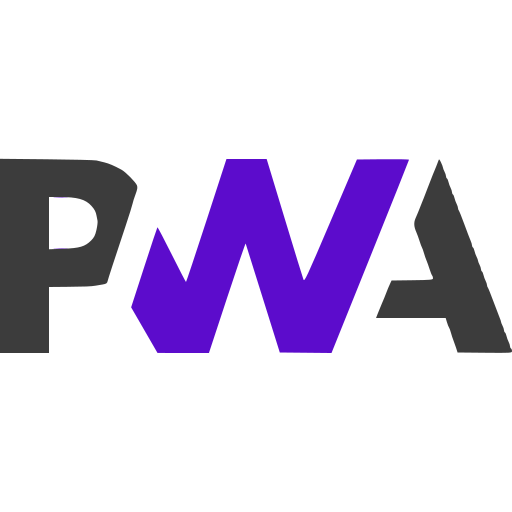

<h1 align="left">Muneeb Shoukat &nbsp; 
</h1>

<!-- Header -->

<!-- Social Media Profile  -->

 
  
  
  

<!-- Introduction  -->

<h2 align="left">
  
  Hi There!
</h1>

I'm a 𝗦𝗲𝗻𝗶𝗼𝗿 𝗦𝗼𝗳𝘁𝘄𝗮𝗿𝗲 𝗘𝗻𝗴𝗶𝗻𝗲𝗲𝗿 focused on building scalable, maintainable, and business-driven software.

I work across frontend and backend systems, translating complex requirements into clean, reliable solutions. I care deeply about architecture, code quality, and long-term maintainability, not just shipping features fast, but shipping them right.

I enjoy solving hard problems, mentoring developers, and continuously refining my technical and product thinking. I actively sharpen my skills through real-world challenges, system design, and hands-on experimentation.

Always learning. Always building. Always improving.

<!-- Skills  -->

<h2 align="left">Skills and Technologies</h2>

  
  
  
  
  
  
  

  
  
  
  
  
  
  
  
  
  
  
  
  
  
   
  
  
  
  
  
  
  
  

  
  
  
  
  
  
  

  
  
  
  
  
  
  

  
  
  
  

  
  
  
  
  
  
  

<!-- Code Contributions -->

<h2 align="left">Code Contributions</h2>

<picture>
  <source media="(prefers-color-scheme: dark)" srcset="https://raw.githubusercontent.com/MuneebStack/CreativeMuneeb/output/github-snake.svg" />
  <source media="(prefers-color-scheme: light)" srcset="https://raw.githubusercontent.com/MuneebStack/CreativeMuneeb/output/github-snake.svg" />
  
</picture>